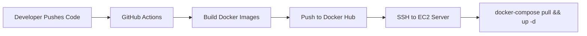

# Full Deployment Plan (Docker & CI/CD Pipeline)

Based on your request, here is the **complete, end-to-end deployment plan** for hosting the entire FraudGuard application using Docker, complete with a fully automated CI/CD pipeline. 

## Time to Complete
**Estimated Time: 1 to 2 Days**
- **Day 1**: Provisioning the AWS EC2 server, securing it, configuring the Docker environment, and setting up the `.env` variables securely.
- **Day 2**: Creating the GitHub Actions CI/CD pipelines, configuring webhooks, and testing the end-to-end automated deployment.

---

## 1. Architectural Overview
We will use a **Single-Node Docker Swarm or Docker Compose** architecture on a free AWS EC2 instance. 
- **Frontend**: Hosted on Vercel (Free, instant global CDN, auto-deploys on GitHub push).
- **Backend (4 Microservices)**: Containerized with Docker and orchestrated using `docker-compose.yml`.
- **API Gateway**: An NGINX container that routes traffic to the correct microservice.
- **Database**: MongoDB Atlas (Cloud-hosted, already set up).
- **CI/CD Pipeline**: GitHub Actions will automatically test, build, and push Docker images, and then trigger a script on your EC2 server to pull the new images and restart the containers without downtime.

---

## 2. The Deployment Pipeline (Step-by-Step)

### Phase 1: Server Provisioning (Manual Setup)
1. **Launch EC2 Instance**: Spin up an AWS `t2.micro` Ubuntu server (Free Tier).
2. **Security Groups**: Open ports `22` (SSH), `80` (HTTP), and `443` (HTTPS).
3. **Install Dependencies**: Install Docker, Docker Compose, and Git on the EC2 server.
4. **Environment Variables**: Create a central `.env` file on the server containing all production secrets (MongoDB URI, JWT Secret, Razorpay keys, Gemini API keys). *These are never stored in GitHub.*

### Phase 2: Containerization (Already Partially Complete)
1. **Dockerfiles**: We already have `Dockerfile`s for `auth-service`, `transaction-service`, `ai-scoring-service`, and `notification-service`.
2. **Orchestration**: We have `infrastructure/docker-compose.yml` which defines how the containers talk to each other on a shared Docker network.
3. **Gateway**: We have an NGINX configuration that acts as the single entry point for all backend traffic.

### Phase 3: The CI/CD Pipeline (GitHub Actions)
We will create a GitHub Actions workflow (`.github/workflows/deploy-backend.yml`). When you push code to the `prod` branch, this pipeline will:
1. **Checkout Code**: Pull the latest code.
2. **Build Images**: Build the Docker images for all 4 microservices.
3. **Push to Registry**: Push the compiled Docker images to Docker Hub (or AWS ECR).
4. **Trigger Deployment**: SSH into your EC2 server (using a private key stored in GitHub Secrets) and run a script to pull the latest images and restart the containers.

### Phase 4: Frontend Deployment
1. Import the `client` folder into Vercel.
2. Set `VITE_API_URL` to point to the public IP or domain name of your EC2 server.
3. Vercel automatically creates its own CI/CD pipeline for the frontend.
