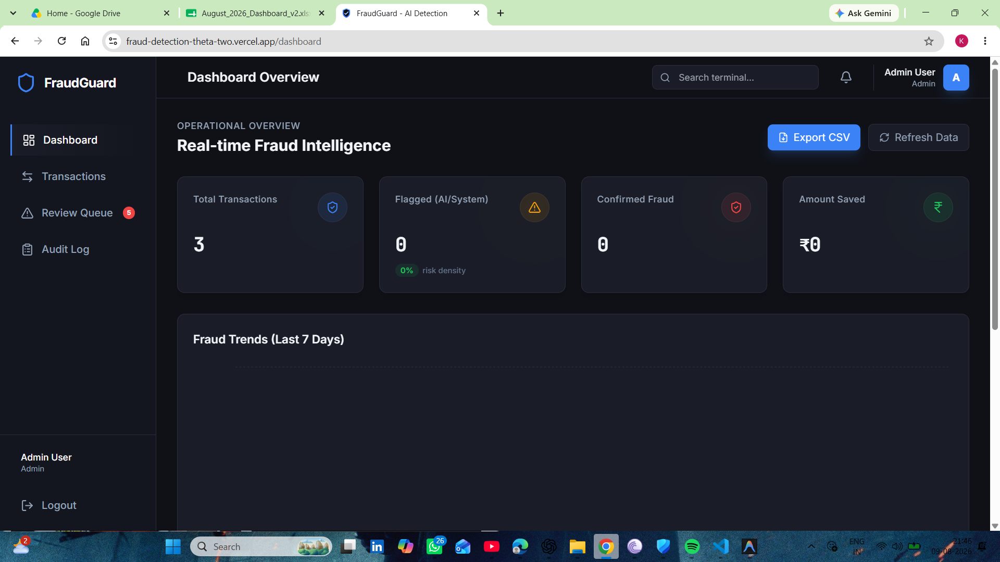
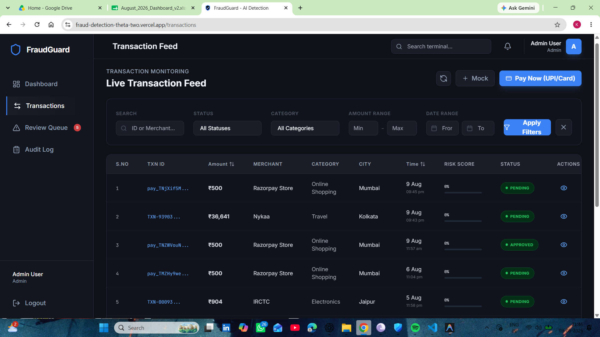
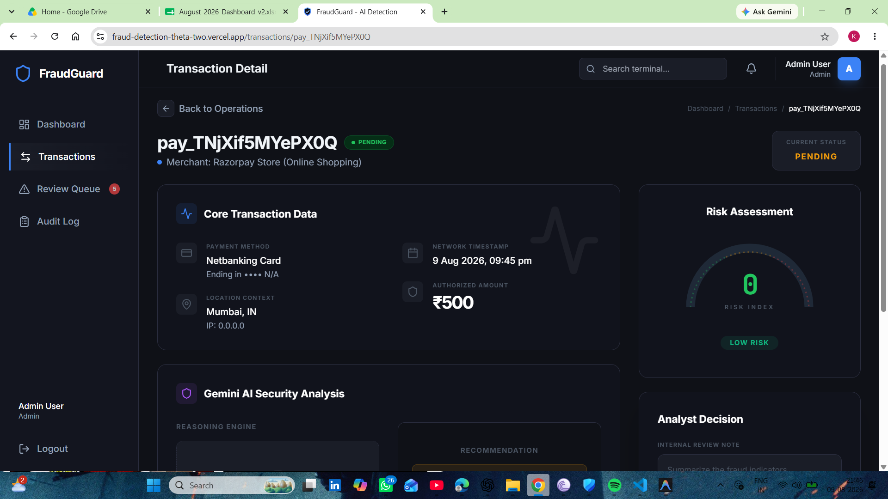

# FraudGuard — AI Fraud Detection (Microservices Architecture)

A high-performance fraud detection system built with a microservices architecture, AWS integration, and real-time AI-powered scoring.

**Live Demo:** [https://d49m8z8w0jzwy.cloudfront.net](https://fraud-detection-theta-two.vercel.app/) *(Note: URL may change based on Vercel/CloudFront deployment)*

## 🏗 Architecture


## 📸 Screenshots

<p align="center">
  
  
  
</p>

## 🧩 Services Overview

The backend is composed of modular microservices communicating via HTTP and Amazon SQS queues.

| Service Name | Tech Stack | Port | Purpose |
|--------------|------------|------|---------|
| **API Gateway** | Node, Express, Proxy | `8080` | Single entry point, proxies requests to microservices, handles CORS |
| **Auth Service** | Node, Express, MongoDB | `3001` | User registration, login, JWT auth |
| **Transaction Service** | Node, Express, MongoDB | `3002` | CRUD for transactions, webhook handling (Razorpay), pushes to SQS |
| **AI Scoring Service** | Node, Gemini API | `3003` | Async worker, scores transactions for fraud via Google Gemini AI |
| **Notification Service**| Node, Express, Socket.io | `3004` | Audit logs and real-time dashboard notifications (WebSockets) |

## 🛠 Tech Stack

| Category | Technologies |
|----------|--------------|
| **Frontend** | React.js (Vite), Tailwind CSS, Redux Toolkit, Recharts |
| **Backend** | Node.js, Express.js |
| **Database** | MongoDB Atlas |
| **Cloud & DevOps** | AWS (EC2, SQS, S3, CloudFront), Docker, NGINX |
| **AI** | Google Gemini API |
| **CI/CD** | GitHub Actions |
| **Payments Integration**| Razorpay Webhooks |

## 🚀 Local Setup

1. **Clone the repository**
   ```bash
   git clone https://github.com/yourusername/FraudGuard.git
   cd FraudGuard
   ```

2. **Set up Environment Variables**
   Create a `.env` file in each service directory with the required keys:

   - **API Gateway (`services/api-gateway/.env`):** `PORT=8080`, `AUTH_SERVICE_URL`, `TRANSACTION_SERVICE_URL`, `NOTIFICATION_SERVICE_URL`
   - **Auth Service (`services/auth-service/.env`):** `PORT=3001`, `MONGO_URI`, `JWT_SECRET`
   - **Transaction Service (`services/transaction-service/.env`):** `PORT=3002`, `MONGO_URI`, `SQS_QUEUE_URL`, `RAZORPAY_KEY_ID`, `RAZORPAY_KEY_SECRET`
   - **AI Scoring Service (`services/ai-scoring-service/.env`):** `PORT=3003`, `MONGO_URI`, `SQS_QUEUE_URL`, `GEMINI_API_KEY`
   - **Notification Service (`services/notification-service/.env`):** `PORT=3004`, `MONGO_URI`, `SQS_QUEUE_URL`
   - **Frontend (`client/.env`):** `VITE_API_URL=http://localhost:8080`

3. **Install Dependencies and Run**
   You can run the microservices using Docker Compose (if configured) or individually by running `npm install` and `npm run dev` in each service's directory.

   *For Frontend:*
   ```bash
   cd client
   npm install
   npm run dev
   ```

4. **Access the application**
   - Frontend: `http://localhost:5173`
   - API Gateway: `http://localhost:8080`

## 🔄 CI/CD Pipeline

The project uses **GitHub Actions** for automated deployments:
- **Backend Services:** Pushes to the `prod` branch trigger building Docker images, pushing to a container registry, and triggering a rolling update on the AWS EC2 instance.
- **Frontend:** Handled automatically via Vercel or S3/CloudFront deployments on commit.

## 🔮 Future Improvements

- Implement a caching layer with Redis to optimize frequent queries.
- Add multi-factor authentication (MFA) for analyst accounts.
- Introduce an automated retry mechanism for failed AI scoring attempts.
- Scale services individually based on load using Kubernetes.

## 👨‍💻 Author

**Keerthi Kumar V**
[LinkedIn](www.linkedin.com/in/kkv074) | [GitHub](https://github.com/Keerthi7423)
